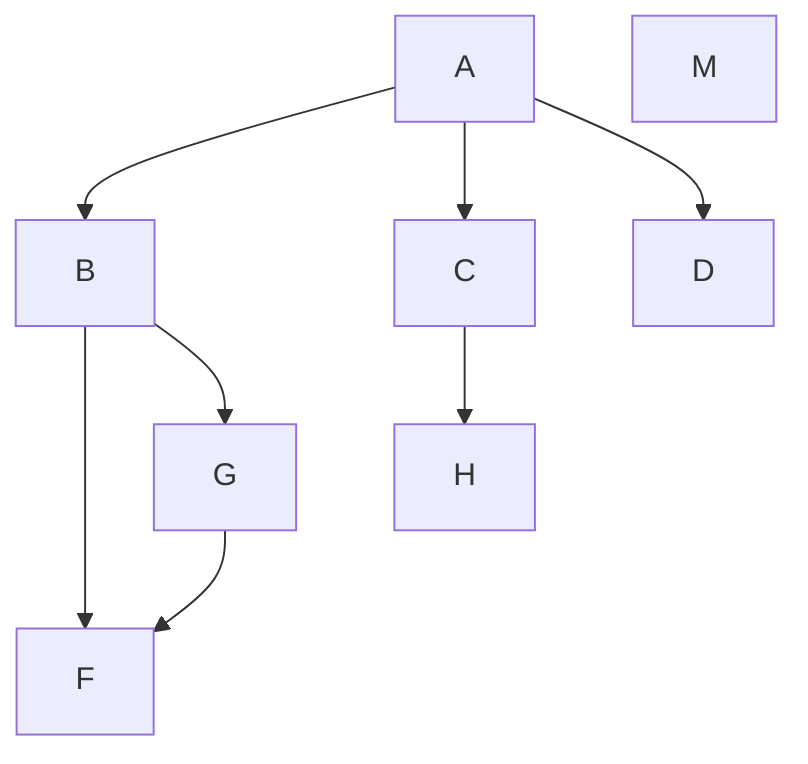
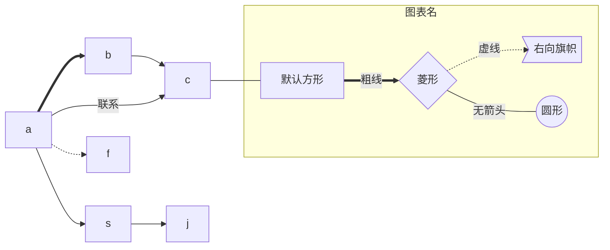
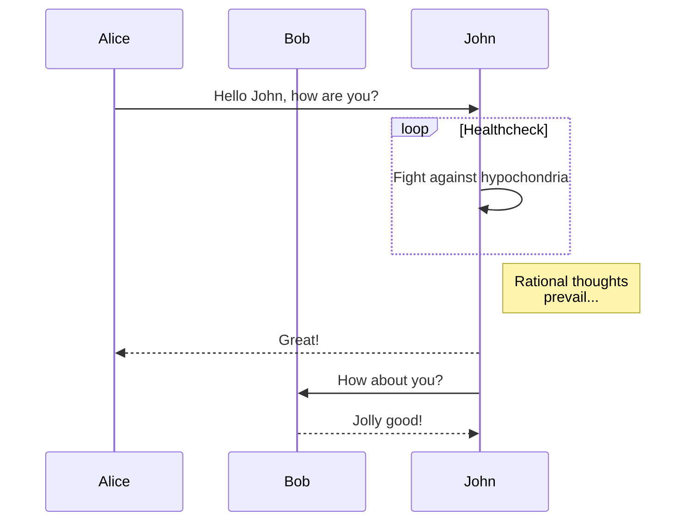
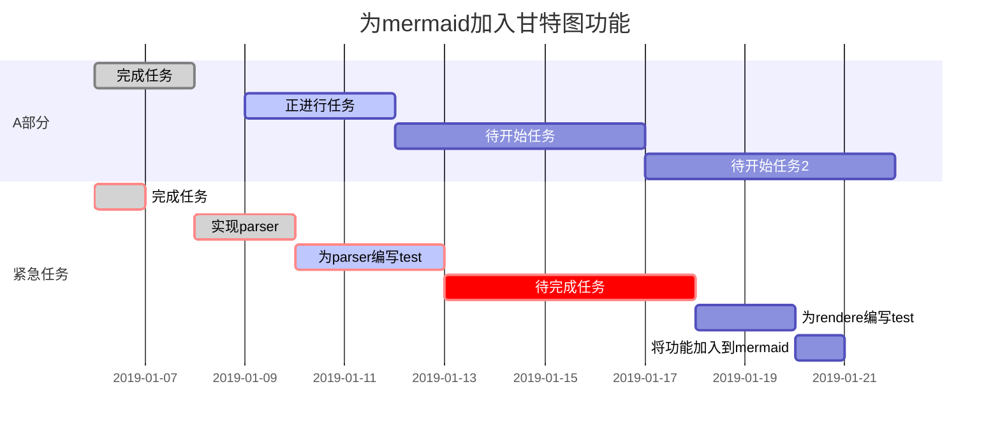

<details markdown="1">
  <summary>目录</summary>

- [Markdown 技巧](#markdown-技巧)
  - [生成目录](#生成目录)
    - [1. 使用 Markdown-TOC](#1-使用-markdown-toc)
    - [2. 使用 doctoc](#2-使用-doctoc)
    - [3.vscode 工具自动生成目录](#3vscode-工具自动生成目录)
    - [4.手写链接](#4手写链接)
    - [5.'TOC'标签生成目录](#5toc标签生成目录)
  - [区块](#区块)
  - [符号 转义符](#符号-转义符)
  - [流程图等](#流程图等)

</details>

# Markdown 技巧

## 生成目录

### 1. 使用 Markdown-TOC

**步骤 1：使用 npm 安装 markdown-toc**
`npm install markdown-toc -g`
**步骤 2：生成目录**
`markdown-toc README.md`
在上面的命令中， `README.md` 是您的 Markdown 文件名。输入此命令将自动生成一个 Markdown 目录。
**步骤 3：将目录插入 Markdown 文件中**
将生成的目录复制到您的 Markdown 文件中。请注意，Markdown-TOC 工具会将目录插入到文件中包含 `<!--toc-->` 标记的位置。

### 2. 使用 doctoc

**步骤 1：使用 npm 安装 doctoc**
`npm install -g doctoc`
**步骤 2：生成目录**
`doctoc README.md`
在上面的命令中， `README.md` 是您的 Markdown 文件名。输入此命令将自动生成一个 Markdown 目录。
**步骤 3：将目录插入 Markdown 文件中**
doctoc 工具会将目录插入到文件中包含 `<!--- START doctoc -->` 和 `<!--- END doctoc -->` 标记之间的位置。您可以将这些标记插入到 Markdown 文件中，然后运行 doctoc 命令以生成和更新目录。

### 3.vscode 工具自动生成目录

**（1）Markdown Preview Enhanced**
`Ctrl + Shift + P` 然后选择 `Markdown Preview Enhanced:Created TOC`

或通过下面命令行自动生成目录

```
<!-- @import "[TOC]" {cmd="toc" depthFrom=1 depthTo=6 orderedList=false} -->
```

保存后如下：

```markdown
<!-- code_chunk_output -->

- [一级标题](#一级标题)
  - [二级标题](#二级标题)
  - [符号 转义符](#符号-转义符)
  - [命令行生成目录](#命令行生成目录)
    - [1. 使用 Markdown-TOC](#1-使用-markdown-toc)
    - [2. 使用 doctoc](#2-使用-doctoc)
    - [vscode 工具](#vscode-工具)

<!-- /code_chunk_output -->
```

**（2）Markdown All in One**

`ctrl+shift+P `输入`Markdown All in One: Create Table of Contents`

### 4.手写链接

- [Markdown 技巧](#markdown-技巧)
  - [生成目录](#生成目录)
    - [1. 使用 Markdown-TOC](#1-使用-markdown-toc)
    - [2. 使用 doctoc](#2-使用-doctoc)
    - [3.vscode 工具自动生成目录](#3vscode-工具自动生成目录)
    - [4.手写链接](#4手写链接)
    - [5.'TOC'标签生成目录](#5toc标签生成目录)
  - [区块](#区块)
  - [符号 转义符](#符号-转义符)
  - [流程图等](#流程图等)

<details markdown="1">
  <summary>点击打开目录</summary>

- [Markdown 技巧](#markdown-技巧)
  - [生成目录](#生成目录)
    - [1. 使用 Markdown-TOC](#1-使用-markdown-toc)
    - [2. 使用 doctoc](#2-使用-doctoc)
    - [3.vscode 工具自动生成目录](#3vscode-工具自动生成目录)
    - [4.手写链接](#4手写链接)
    - [5.'TOC'标签生成目录](#5toc标签生成目录)
  - [区块](#区块)
  - [符号 转义符](#符号-转义符)
  - [流程图等](#流程图等)

</details>

### 5.'TOC'标签生成目录

[TOC]

**注意：**
Markdown 可以使用[TOC]自动生成 Markdown 文件的标题目录，比如在 typora，vscode(需要插件)等本地编辑器中。

但是在网页上比如：Github 不支持[TOC]标签，所以在 Github 的 README.md 上使用[TOC]无法正确显示目录。

## 区块

> 这里是区块

> 这里是区块
> 这里是区块

> 这里是嵌套区块
>
> > 这里是嵌套区块
> >
> > > 这里是嵌套区块

## 符号 转义符

< &#60;

>     &#62;

& &#38;

@ &#64;

## 流程图等

Flowchart（流程图）
注意：

```
方向
符号	意义
TB	从上到下
BT	从下到上
RL	从右到左
LR	从左到右
图线
符号	意义
>	添加尾部箭头
-	不添加尾部箭头
--	单线
--text--	单线上加文字
==	粗线
==text==	粗线加文字
-.-	虚线
-.text.-	虚线加文字
节点
表述	说明
id[文字]	矩形节点
id(文字)	圆角矩形节点
id((文字))	圆形节点
id>文字]	右向旗帜状节点
id{文字}	菱形节点

```





Sequence diagram(顺序图)



甘特图(Gantt diagram)


