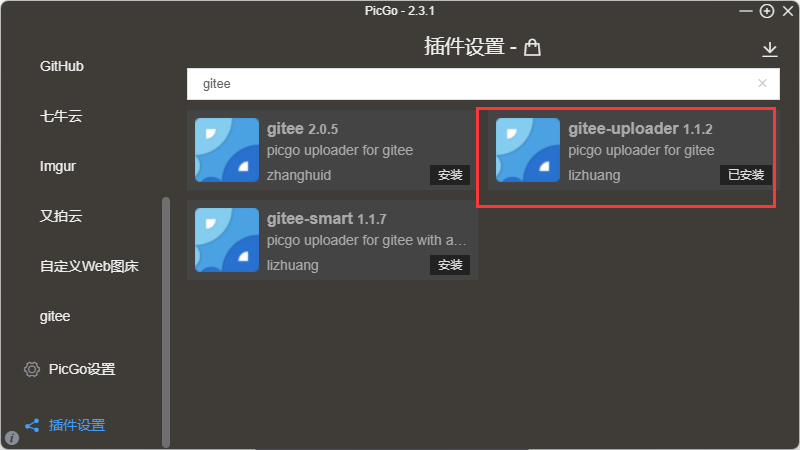

# 图床推荐

## 一、 路过图床

https://imgtu.com/

## 二、 imgurl

https://www.imgurl.org/vip/manage/upload

https://doc.xiaoz.org/books/imgurl-pro/page/picgo

## 三、 PicGo（推荐）

- PicGo: 一个用于快速上传图片并获取图片 URL 链接的工具

- 官方文档：https://picgo.github.io/PicGo-Doc/

- 下载地址：https://github.com/Molunerfinn/PicGo/releases

**配置**

### 1. GitHub 平台

- 在 GitHub 上新建一个仓库 imgs,用于存储图片

- 生成一个 token 用于 PicGo 操作你的仓库：

访问：https://github.com/settings/tokens

然后点击 Generate new token。

把 repo 的勾打上即可。然后翻到页面最底部，点击 Generate token 的绿色按钮生成 token。

**注意：**这个 token 生成后只会显示一次！你要把这个 token 复制一下存到其他地方以备以后要用。

在 PicGo 上配置 GitHub 上传

自定义域名：`https://cdn.jsdelivr.net/gh/bin59/imgs@main`

- 配置完成后上传图片

- 复制链接

``

- 粘贴使用

### 2. Gitee 平台（推荐）

- 首先搜索`Gitee`下载插件

- 登录 gitee 平台建一个仓库`imgs`

- 创建私人令牌
